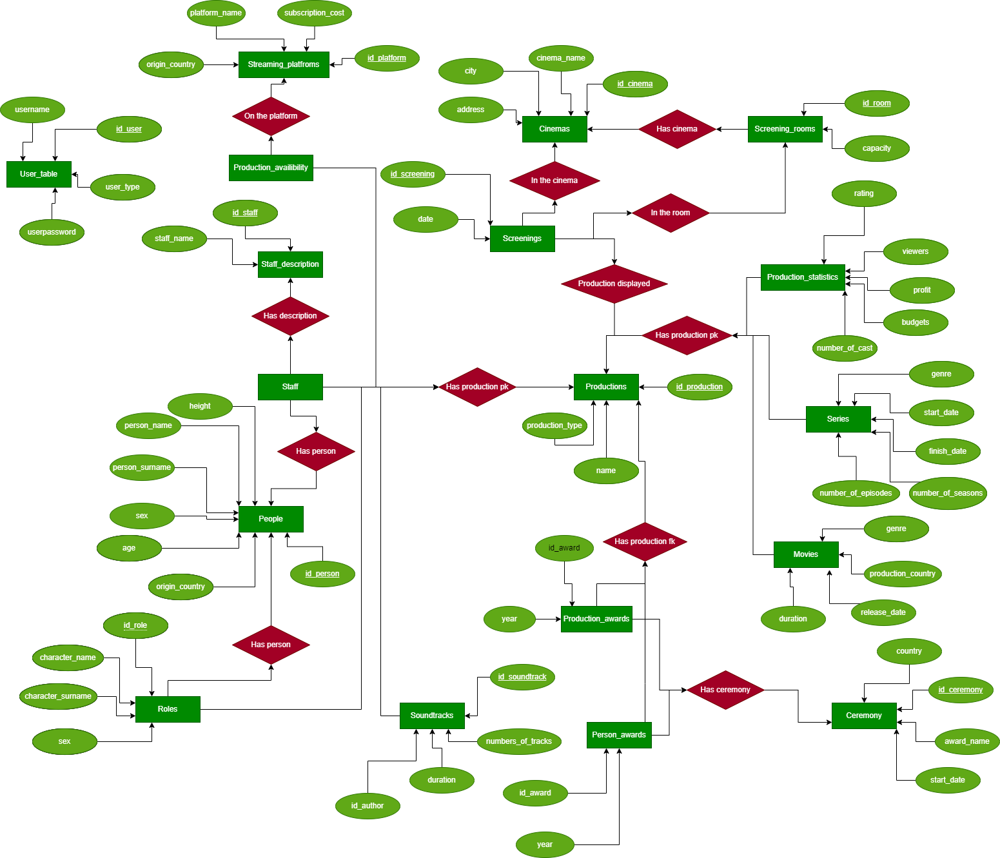
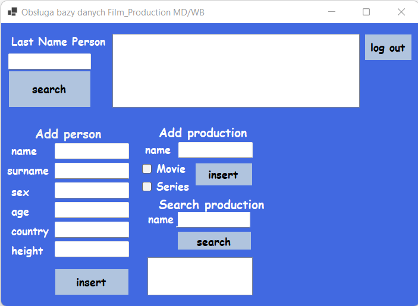
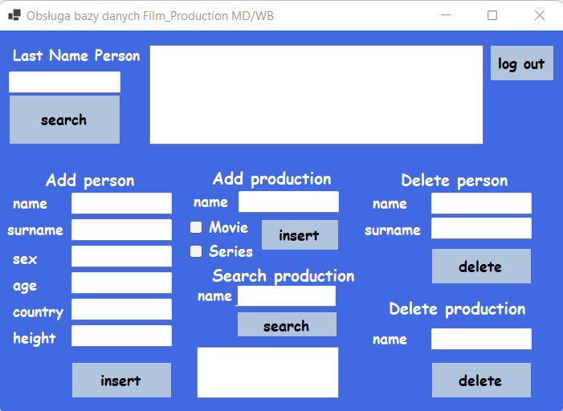

## Założenia projektu
Celem projektu jest stworzenie serwisu ułatwiającego wyszukiwanie danych dotyczących produkcji filmowych, serialowych i osób z nimi związanych.
Baza może zostać użyta przez aplikacje, portale zajmujące się ocenami filmowymi, gromadzeniem informacji o filmach, serialach i postaciach kina. Podstawowymi założeniami projektu jest prostota i dbanie o to, żeby w bazie było jak najmniej zduplikowanych rekordów.

## Schemat pielęgnacji bazy danych
Z roku na rok powstają kolejne produkcje filmowe i serialowe, więc z racji dużego nagromadzenia danych w bazie, nie możemy pozwolić sobie, żeby dane zostały utracone.
To wiązało by się z ponownym wprowadzaniem rekordów do bazy, co może być utrudnione ze względu na ich ilość i powiązania.
Z tego powodu zalecane jest tworzenie kopii zapasowej w okresach, kiedy ilosć wprowadzanych danych do systemu będzie odpowiednio duża.
Oprócz tego należy robić pełną kopię 1 raz w tygodniu.

## Diagram ER
Na diagramie znajduję sie graficzna reprezentacja zależności pomiędzy tabelami w naszej bazie.


## Schemat bazy danych


## Spis tabel
1. User_table
2. Production_statistics
3. Streaming_platforms
4. Movies
5. Series
6. Staff_description
7. Staff
8. Roles
9. Soundtracks
10. Cinemas
11. Production_availability
12. Production_awards
13. Award_ceremonies
14. Screening_rooms
15. People
16. Person_awards
17. Screenings
18. Productions

## Widoki
Utworzone widoki pozwalają na pokazanie często wybieranych danych
```sql
--1 Widok: pokaż wszytskich aktorów w tabeli People
CREATE VIEW All_actors AS
    SELECT DISTINCT p.*
    FROM People p
    JOIN Staff s ON (p.id_person = s.id_person)
    JOIN Staff_description sd ON (sd.id_staff = s.id_staff)
    WHERE sd.staff_name = 'actor';
```

```sql
--2 Widok: pokaż dla każdego aktora ilość jego nagród (korzysta z widoku All_actors)
CREATE VIEW Number_of_awards AS
    SELECT aa.id_person, person_name, person_surname, COUNT(id_award) AS awards_count
    FROM All_actors aa
    JOIN Person_awards pa ON (aa.id_person = pa.id_person)
    GROUP BY aa.id_person, person_name, person_surname;
```

```sql
--3 Widok: pokaż dla każdego aktora ilość jego ról w tabeli Roles (korzysta z widoku All_actors)
CREATE VIEW Number_of_roles AS
    SELECT aa.id_person, person_name, person_surname, COUNT(id_role) AS role_count
    FROM Roles r
    JOIN All_actors aa ON(r.id_person = aa.id_person)
    GROUP BY aa.id_person, person_name, person_surname;
```

```sql
--4 Widok: pokaż dla każdego kina średni budżet filmów, które były w nim wyświetlane
CREATE VIEW Average_budget_through_cinema AS
    SELECT c.id_cinema, c.cinema_name, c.city, c.address, CAST(ROUND(AVG(ps.budget), 2) AS DECIMAL(20, 0)) AS average_budget
    FROM Cinemas c
    JOIN Screenings s ON(c.id_cinema = s.id_cinema)
    JOIN Production_statistics ps ON(s.id_production = ps.id_production)
    GROUP BY c.id_cinema, c.cinema_name, c.city, c.address;
```

```sql
--5 Widok: pokaż ile każdy gatunek filmowy dostał nagród i jakich konkretnie (typowo dla produkcji)
CREATE VIEW Genre_awards AS
    SELECT ac.award_name, m.genre, COALESCE(COUNT(pa.id_production), 0) AS awards_count
    FROM Award_ceremonies ac
    JOIN Production_awards pa ON (ac.id_ceremony = pa.id_ceremony)
    JOIN Movies m ON (pa.id_production = m.id_production)
    GROUP BY ac.award_name, m.genre
    ORDER BY ac.award_name OFFSET 0 ROWS;
```

```sql
--6 Widok: pokaż ile każda produkcja zarobiła na 1 oglądającym i wyświetl jej nazwę i id
CREATE VIEW Money_from_one_person AS
    SELECT ps.id_production, p.name, CAST(ROUND(profit / viewers, 2) AS DECIMAL(20, 2)) AS profit_per_person
    FROM Production_statistics ps
    JOIN Productions p ON (p.id_production = ps.id_production)
```

```sql
--7 Widok: pokaz ile produkcji znajduje sie na kazdej platformie streamingowej
CREATE VIEW Number_of_productions_available AS
    SELECT sp.id_platform, sp.platform_name, COALESCE(COUNT(pa.id_production), 0) as [number_of_productions]
    FROM Streaming_platforms sp
    LEFT JOIN Production_availability pa ON (pa.id_platform = sp.id_platform)
    GROUP BY sp.platform_name, sp.id_platform;
```

## Funkcje
Funkcje służą za sparametryzowane widoki, pozwalają pokazywać dane dotyczące konkretnych osób/produkcji/nagród w bazie danych

```sql
--1 Funkcja: pokaz wszystkie filmy grane w danym mieście w danym dniu
CREATE FUNCTION cinema_schedule_city (@date DATE, @city VARCHAR(256))
RETURNS @schedule TABLE
(
    [Time] TIME,
    [Cinema chain] VARCHAR(256),
    [Address] VARCHAR(256),
    [Production name] VARCHAR(256)
)
AS
BEGIN
    IF @city NOT IN (SELECT city FROM Cinemas)
    BEGIN
        INSERT INTO @schedule VALUES (NULL, 'No cinemas', 'in', 'such city')
    END
    ELSE
    BEGIN
    INSERT INTO @schedule
        SELECT CAST(s.date AS time(0)), c.cinema_name, c.address, p.name
        FROM Cinemas c
        JOIN Screenings s ON (c.id_cinema = s.id_cinema)
        JOIN Productions p ON (p.id_production = s.id_production)
        WHERE CAST(s.date AS date) = @date
        AND c.city = @city
    END
    RETURN
END
```

```sql
--2 Funkcja: pokaz wszystkie filmy, w których dana osoba pełniła jakąś rolę, oraz wypisz tę rolę
CREATE FUNCTION all_productions_to_person(@name VARCHAR(256), @surname VARCHAR(256))
RETURNS @productions TABLE
(
    [Name] VARCHAR(256),
    [Staff type] VARCHAR(256)
)
AS
BEGIN
    IF @name NOT IN (SELECT person_name FROM People) OR @surname NOT IN (SELECT person_surname FROM People)
    BEGIN
        INSERT INTO @productions VALUES ('Given person doesn''t exist', NULL)
    END
    ELSE
    BEGIN
        INSERT INTO @productions
        SELECT p.name, sd.staff_name
        FROM Productions p
        JOIN Staff s ON (s.id_production = p.id_production)
        JOIN People pe ON (pe.id_person = s.id_person)
        JOIN Staff_description sd ON (sd.id_staff = s.id_staff)
        WHERE pe.person_name = @name AND pe.person_surname = @surname
    END
    RETURN
END
```

```sql
--3 Funkcja: pokaz wszystkich zwyciezcow danej nagrody wraz z produkcją, za którą otrzymali tę nagrodę oraz rok przyznania nagrody
CREATE FUNCTION award_winners (@name VARCHAR(256))
RETURNS @winners TABLE
(
    [Name] VARCHAR(256),
    [Surname] VARCHAR(256),
    [Production name] VARCHAR(256),
    [Year] INT
)
AS
BEGIN
    IF @name NOT IN (SELECT award_name FROM Award_ceremonies)
    BEGIN
        INSERT INTO @winners VALUES ('No', 'such', 'award', NULL)
    END
    ELSE
    BEGIN
    INSERT INTO @winners
        SELECT pe.person_name, pe.person_surname, p.name, pa.year
        FROM Person_awards pa
        JOIN Award_ceremonies ac ON (ac.id_ceremony = pa.id_ceremony)
        JOIN People pe ON (pe.id_person = pa.id_person)
        JOIN Staff s ON (s.id_person = pe.id_person)
        JOIN Productions p ON (p.id_production = s.id_production)
        WHERE ac.award_name = @name
    END
    RETURN
END
```

## Procedury Składowane
Procedury składowane w naszej bazie pozwalają np. na wypisanie osób kina na zadaną literę, czy np wypisania szczegółowych danych na temat serialów

```sql
--1 Procedura składowana: wypisuje wszytskie dane aktora, którego nazwisko zaczyna się na @character
GO
CREATE PROC actors_starts_with
(@character CHAR)
AS
	SELECT *
    FROM All_actors
    WHERE person_surname LIKE @character + '%'
    ORDER BY person_name
GO
```

```sql
--2 Procedura składowana: dodaj aktora (dodaj osobe a potem rekord w staff)
GO
CREATE PROC add_actor
(
    @name VARCHAR(256),
    @surname VARCHAR(256),
    @sex VARCHAR(1),
    @age INT,
    @country VARCHAR(256),
    @height INT,
    @production_name VARCHAR(256) = NULL
)
AS
    DECLARE @id_production INT = (
        SELECT id_production
        FROM Productions
        WHERE name = @production_name
    );

    IF @id_production IS NOT NULL
    BEGIN
        INSERT INTO People VALUES
        (@name, @surname, @sex, @age, @country, @height);

        DECLARE @actor_in_staff INT = (
            SELECT id_staff
            FROM Staff_description
            WHERE staff_name = 'actor'
        );

        DECLARE @id_person INT = (SELECT IDENT_CURRENT('People'));

        INSERT INTO Staff VALUES
        (@actor_in_staff, @id_person, @id_production);
    END
    ELSE
    BEGIN
        THROW 80004001, 'Production name can''t be null', 1
    END
GO
```

```sql
--3 Procedura składowana: dodaj film
GO
CREATE PROC add_film
(
    @name VARCHAR(256) = NULL,
    @genre VARCHAR(256),
    @country VARCHAR(256),
    @date DATE,
    @duration INT
)
AS
    IF @name IS NOT NULL
    BEGIN
        IF @name NOT IN (SELECT name FROM Productions WHERE production_type = 'Movie')
        BEGIN
            INSERT INTO Productions VALUES
            (@name, 'Movie');

            DECLARE @id_production INT = (
                    SELECT IDENT_CURRENT('Productions')
            );
            INSERT INTO Movies VALUES
            (@id_production, @genre, @country, @date, @duration);
        END
        ELSE
        BEGIN
            THROW 80060103, 'Given movie already exists', 1
        END
    END
    ELSE
    BEGIN
        THROW 80004001, 'Name of added movie can''t be null', 1
    END
GO
```

```sql
--4 Procedura składowana: podwyższa/obniża rating o @value dla wszystkich produkcji, w której grał dany aktor
GO
CREATE PROC increase_rating_through_person
(
    @name VARCHAR(256),
    @surname VARCHAR(256),
    @value FLOAT
)
AS
    DECLARE @searched_id INT =
    (
        SELECT id_person
        FROM People
        WHERE person_name = @name AND person_surname = @surname
    );

    IF @searched_id IS NOT NULL
    BEGIN
        UPDATE Production_statistics
		SET rating = rating + @value
		WHERE id_production IN (
		    SELECT id_production
		    FROM Staff
		    WHERE id_person = @searched_id
		);
    END
    ELSE
    BEGIN
        THROW 80060103, 'Given actor doesnt exist', 1
    END
GO
```

```sql
--5 Procedura składowana: dla każdego serialu pokaż długość emitowania, liczbę odcinków na sezon, rating oraz liczbę nagród
GO
CREATE PROC show_series_statistics
AS
    SELECT finish_year - start_year + 1 AS emission_years, number_of_episodes / number_of_seasons AS episodes_per_season,
           rating, counted_awards
    FROM Series s
    JOIN Production_statistics ps ON (s.id_production = ps.id_production)
    JOIN (
        SELECT id_production, COUNT(id_production) AS counted_awards
        FROM Production_awards
        GROUP BY id_production
    ) c ON (c.id_production = s.id_production)
GO
```

```sql
--Procedury używane w aplikacji klienckiej:
GO
CREATE PROC addperson
(
    @name VARCHAR(256),
    @surname VARCHAR(256),
    @sex VARCHAR(1),
    @age INT,
    @country VARCHAR(256),
    @height INT
)
AS
    INSERT INTO People VALUES
    (@name, @surname, @sex, @age, @country, @height);
GO
USE Film_Production
GO
CREATE PROC deleteperson
(
    @name VARCHAR(256),
    @surname VARCHAR(256)
)
AS
    DELETE FROM People
	WHERE person_name = @name AND person_surname = @surname;
GO

GO
CREATE PROC addproduction
(
    @name VARCHAR(256),
    @type VARCHAR(256)
)
AS
    INSERT INTO Productions VALUES
    (@name, @type);
GO
GO
CREATE PROC deleteproduction
(
    @name VARCHAR(256)
)
AS
    DELETE FROM Productions
	WHERE name = @name;
GO
```

## Wyzwalacze
Wyzwalacze w bazie automatycznie aktualizują dane dotyczące produkcji, przy wprowadzaniu/usuwaniu danych do innych tabel

```sql
--1 Wyzwalacz: zwiekszenie liczności obsady przy dodaniu osoby pełniącej dowolne stanowisko przy produkcji
GO
CREATE TRIGGER add_cast
ON Staff
AFTER INSERT, UPDATE
AS
BEGIN
    SET NOCOUNT ON;
    DECLARE @productionID INT
    SELECT @productionID = INSERTED.id_production FROM INSERTED

    UPDATE Production_statistics
    SET number_of_cast = number_of_cast + 1
    WHERE id_production = @productionID
END
```

```sql
--2 Wyzwalacz: zmniejszenie liczności obsady przy usunięciu osoby pełniącej dowolne stanowisko przy produkcji
GO
CREATE TRIGGER delete_cast
ON Staff
AFTER DELETE, UPDATE
AS
BEGIN
    SET NOCOUNT ON;
    DECLARE @productionID INT
    SELECT @productionID = DELETED.id_production FROM DELETED

    UPDATE Production_statistics
    SET number_of_cast = number_of_cast - 1
    WHERE id_production = @productionID
END
```

```sql
--3 Wyzwalacz: dodanie ilości widzów przy dodaniu seansu danej produkcji
GO
CREATE TRIGGER add_viewers
ON Screenings
AFTER INSERT, UPDATE
AS
BEGIN
    SET NOCOUNT ON;
    DECLARE @productionID INT,
    @roomID INT
    SELECT @productionID = INSERTED.id_production FROM INSERTED
    SELECT @roomID = INSERTED.id_room FROM INSERTED;

    UPDATE Production_statistics
    SET viewers = viewers + (SELECT capacity FROM Screening_rooms WHERE id_room = @roomID)
    WHERE id_production = @productionID
END
```

```sql
--4 Wyzwalacz: odjęcie ilości widzów przy usunięciu seansu danej produkcji
GO
CREATE TRIGGER remove_viewers
ON Screenings
AFTER DELETE, UPDATE
AS
BEGIN
    SET NOCOUNT ON;
    DECLARE @productionID INT,
    @roomID INT
    SELECT @productionID = DELETED.id_production FROM DELETED
    SELECT @roomID = DELETED.id_room FROM DELETED;

    UPDATE Production_statistics
    SET viewers = viewers - (SELECT capacity FROM Screening_rooms WHERE id_room = @roomID)
    WHERE id_production = @productionID
END
```

```sql
--5 Wyzwalacz: zwiększenie (zmniejszenie przy jednej nagrodzie) ratingu produkcji dodając nagrodę, którą ta produkcja otrzymała
GO
CREATE TRIGGER change_rating_award1
ON Production_awards
AFTER INSERT, UPDATE
AS
BEGIN
    SET NOCOUNT ON;
    DECLARE @productionID INT,
    @ceremonyID INT,
    @currentRating INT

    SELECT @productionID = INSERTED.id_production FROM INSERTED
    SELECT @ceremonyID = INSERTED.id_ceremony FROM INSERTED
    SELECT @currentRating = rating FROM Production_statistics WHERE id_production = @productionID;

    IF(@currentRating < 10.0 AND @currentRating > 0.0)
        UPDATE Production_statistics
        SET rating = (CASE
                    WHEN @ceremonyID IN (SELECT id_ceremony FROM Award_ceremonies WHERE award_name = 'Golden Raspberry Award')
                    THEN ROUND(rating - 0.1, 1)
                    ELSE
                    ROUND(rating + 0.1, 1)
                END)
        WHERE id_production = @productionID
END
```

```sql
--6 Wyzwalacz: zmniejszenie (zwiększenie przy jednej nagrodzie) ratingu produkcji, dla której usunięto nagrodę
GO
CREATE TRIGGER change_rating_award2
ON Production_awards
AFTER DELETE, UPDATE
AS
BEGIN
    SET NOCOUNT ON;
    DECLARE @productionID INT,
    @ceremonyID INT,
    @currentRating INT

    SELECT @productionID = DELETED.id_production FROM DELETED
    SELECT @ceremonyID = DELETED.id_ceremony FROM DELETED
    SELECT @currentRating = rating FROM Production_statistics WHERE id_production = @productionID;

    IF(@currentRating < 10.0 AND @currentRating > 0.0)
        UPDATE Production_statistics
        SET rating = (CASE
                    WHEN @ceremonyID IN (SELECT id_ceremony FROM Award_ceremonies WHERE award_name = 'Golden Raspberry Award')
                    THEN ROUND(rating + 0.1, 1)
                    ELSE
                    ROUND(rating - 0.1, 1)
                END)
        WHERE id_production = @productionID
END
```

## Skrypt tworzący bazę danych
Skrypt ten tworzy wyżej wymienione tabele, wraz z wszystkimi kluczami głównymi i obcymi, upewniając się czy baza o danej nazwie już nie istnieje

```sql
IF OBJECT_ID('Film_Production', 'U') IS NOT NULL
    DROP DATABASE Film_Production
CREATE DATABASE Film_Production
GO
USE Film_Production

CREATE TABLE Productions (
    id_production INT PRIMARY KEY IDENTITY(1,1),
    name VARCHAR(256) NOT NULL,
    production_type VARCHAR(256) NOT NULL
);

CREATE TABLE Movies (
    id_production INT PRIMARY KEY,
    genre VARCHAR(256) NOT NULL,
    production_country VARCHAR(256) NOT NULL,
    release_date DATE NOT NULL,
    duration INT NOT NULL
);

ALTER TABLE Movies
ADD Constraint [Movie ID] FOREIGN KEY (id_production) REFERENCES Productions(id_production) ON DELETE CASCADE ON UPDATE CASCADE;

CREATE TABLE Series (
    id_production INT PRIMARY KEY,
    genre VARCHAR(256) NOT NULL,
    start_year INT NOT NULL,
    finish_year INT,
    number_of_seasons INT NOT NULL,
    number_of_episodes INT NOT NULL
);

ALTER TABLE Series
ADD Constraint [Series ID] FOREIGN KEY (id_production) REFERENCES Productions(id_production) ON DELETE CASCADE ON UPDATE CASCADE;

CREATE TABLE Production_statistics (
    id_production INT PRIMARY KEY,
    profit MONEY NOT NULL,
    budget MONEY NOT NULL,
    viewers INT,
    number_of_cast INT,
    rating FLOAT
)

ALTER TABLE Production_statistics
ADD Constraint [Production ID] FOREIGN KEY (id_production) REFERENCES Productions(id_production) ON DELETE CASCADE ON UPDATE CASCADE;

CREATE TABLE Cinemas (
    id_cinema INT PRIMARY KEY IDENTITY(1,1),
    cinema_name VARCHAR(256) NOT NULL,
    city VARCHAR(256) NOT NULL,
    address VARCHAR(256) NOT NULL
);

CREATE TABLE Screenings (
    id_screening INT PRIMARY KEY IDENTITY(1,1),
    id_cinema INT NOT NULL,
    date SMALLDATETIME NOT NULL,
    id_production INT NOT NULL,
    id_room INT NOT NULL
);

ALTER TABLE Screenings
ADD Constraint [Cinema ID] FOREIGN KEY (id_cinema) REFERENCES Cinemas(id_cinema) ON DELETE CASCADE ON UPDATE CASCADE;

ALTER TABLE Screenings
ADD Constraint [Production ID1] FOREIGN KEY (id_production) REFERENCES Productions(id_production) ON DELETE CASCADE ON UPDATE CASCADE;

CREATE TABLE Streaming_platforms (
    id_platform INT PRIMARY KEY IDENTITY(1,1),
    platform_name VARCHAR(256) NOT NULL,
    subscription_cost MONEY NOT NULL,
    origin_country VARCHAR(256) NOT NULL
);

CREATE TABLE Production_availability (
    id_production INT NOT NULL,
    id_platform INT NOT NULL
);

ALTER TABLE Production_availability
ADD Constraint [Production ID2] FOREIGN KEY (id_production) REFERENCES Productions(id_production) ON DELETE CASCADE ON UPDATE CASCADE;

ALTER TABLE Production_availability
ADD Constraint [Platform ID] FOREIGN KEY (id_platform) REFERENCES Streaming_platforms(id_platform) ON DELETE CASCADE ON UPDATE CASCADE;

CREATE TABLE Staff_description (
    id_staff INT PRIMARY KEY IDENTITY(1,1),
    staff_name VARCHAR(256) NOT NULL
);

CREATE TABLE Staff (
    id_staff INT NOT NULL,
    id_person INT NOT NULL,
    id_production INT NOT NULL
);

ALTER TABLE Staff
ADD Constraint [Staff ID] FOREIGN KEY (id_staff) REFERENCES Staff_description(id_staff) ON DELETE CASCADE ON UPDATE CASCADE;

ALTER TABLE Staff
ADD Constraint [Production ID3] FOREIGN KEY (id_production) REFERENCES Productions(id_production) ON DELETE CASCADE ON UPDATE CASCADE;

CREATE TABLE People (
    id_person INT PRIMARY KEY IDENTITY(1,1),
    person_name VARCHAR(256) NOT NULL,
    person_surname VARCHAR(256) NOT NULL,
    sex VARCHAR(1) NOT NULL,
    age INT NOT NULL,
    origin_country VARCHAR(256) NOT NULL,
    height INT NOT NULL
);

ALTER TABLE Staff
ADD Constraint [Person ID] FOREIGN KEY (id_person) REFERENCES People(id_person) ON DELETE CASCADE ON UPDATE CASCADE;

CREATE TABLE Roles (
    id_role INT PRIMARY KEY IDENTITY(1,1),
    character_name VARCHAR(256) NOT NULL,
    character_surname VARCHAR(256) NOT NULL,
    sex VARCHAR(1) NOT NULL,
    id_production INT NOT NULL,
    id_person INT NOT NULL
);

ALTER TABLE Roles
ADD Constraint [Production ID4] FOREIGN KEY (id_production) REFERENCES Productions(id_production) ON DELETE CASCADE ON UPDATE CASCADE;

ALTER TABLE Roles
ADD Constraint [Person ID1] FOREIGN KEY (id_person) REFERENCES People(id_person) ON DELETE CASCADE ON UPDATE CASCADE;

CREATE TABLE Soundtracks (
    id_soundtrack INT PRIMARY KEY IDENTITY(1,1),
    number_of_tracks INT NOT NULL,
    duration INT NOT NULL,
    id_production INT NOT NULL,
    id_author INT NOT NULL
);

ALTER TABLE Soundtracks
ADD Constraint [Production ID5] FOREIGN KEY (id_production) REFERENCES Productions(id_production) ON DELETE CASCADE ON UPDATE CASCADE;

ALTER TABLE Soundtracks
ADD Constraint [Author ID] FOREIGN KEY (id_author) REFERENCES People(id_person) ON DELETE CASCADE ON UPDATE CASCADE;

CREATE TABLE Award_ceremonies (
    id_ceremony INT PRIMARY KEY IDENTITY(1,1),
    award_name VARCHAR(256) NOT NULL,
    start_date DATE NOT NULL,
    country VARCHAR(256) NOT NULL
);


CREATE TABLE Person_awards (
    id_award INT PRIMARY KEY IDENTITY(1,1),
    year INT NOT NULL,
    id_person INT NOT NULL,
    id_production INT NOT NULL,
    id_ceremony INT NOT NULL
);

ALTER TABLE Person_awards
ADD Constraint [Ceremony ID] FOREIGN KEY (id_ceremony) REFERENCES Award_ceremonies(id_ceremony) ON DELETE CASCADE ON UPDATE CASCADE;

ALTER TABLE Person_awards
ADD Constraint [Person ID2] FOREIGN KEY (id_person) REFERENCES People(id_person) ON DELETE CASCADE ON UPDATE CASCADE;

ALTER TABLE Person_awards
ADD Constraint [Production ID6] FOREIGN KEY (id_production) REFERENCES Productions(id_production) ON DELETE CASCADE ON UPDATE CASCADE;

CREATE TABLE Production_awards (
    id_award INT PRIMARY KEY IDENTITY(1,1),
    year INT NOT NULL,
    id_production INT NOT NULL,
    id_ceremony INT NOT NULL
);

ALTER TABLE Production_awards
ADD Constraint [Ceremony ID1] FOREIGN KEY (id_ceremony) REFERENCES Award_ceremonies(id_ceremony) ON DELETE CASCADE ON UPDATE CASCADE;

ALTER TABLE Production_awards
ADD Constraint [Production ID7] FOREIGN KEY (id_production) REFERENCES Productions(id_production) ON DELETE CASCADE ON UPDATE CASCADE;

CREATE TABLE User_table (
    id_user INT PRIMARY KEY IDENTITY(1,1),
    username VARCHAR(255),
    userpassword VARCHAR(255),
    user_type VARCHAR(255)
);
CREATE TABLE Screening_rooms (
    id_room INT PRIMARY KEY IDENTITY(1,1),
    id_cinema INT NOT NULL,
    capacity INT NOT NULL
);

ALTER TABLE Screening_rooms
ADD Constraint [Cinema ID1] FOREIGN KEY (id_cinema) REFERENCES Cinemas(id_cinema) ON DELETE CASCADE ON UPDATE CASCADE;

ALTER TABLE Screenings
ADD Constraint [Screening room ID] FOREIGN KEY (id_room) REFERENCES Screening_rooms(id_room) ON DELETE CASCADE ON UPDATE CASCADE;
```

## Indeksy
Indeksy utworzone zostały na kolumnach, które będą najczęściej wyszukiwanie - nazwy produkcji, dane osób kina

```sql
CREATE INDEX person1 ON People(person_name, person_surname);
CREATE INDEX role1 ON Roles(character_name, character_surname);
CREATE INDEX production1 ON Productions(name);
CREATE INDEX production2 ON Production_statistics(id_production);
CREATE INDEX movies1 ON Movies(id_production);
CREATE INDEX series1 ON Series(id_production);
```

## Aplikacja kliencka
panel logowania 


widok dla użytkownika



widok dla admina 



